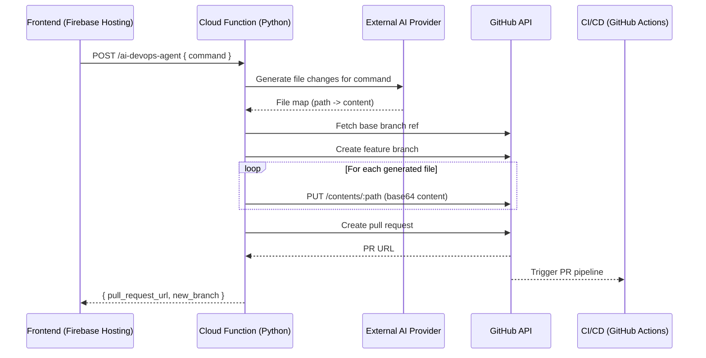

# Firebase DevOps Architecture for the AI Code Workshop

This document captures the Firebase-first architecture for enabling the "Agent Scrum" workflow to generate code, collaborate through GitHub, and trigger downstream CI/CD.

## Overview

The solution is split between a static frontend hosted on Firebase Hosting and a backend implemented as an HTTP Cloud Function. The function is responsible for orchestrating AI-assisted code generation and DevOps automation against a remote GitHub repository via its REST API.



## Firebase Cloud Function

The `functions/main.py` module exposes the `ai_devops_agent` entrypoint via the Python Functions Framework. The handler performs the following:

1. Validates the incoming JSON payload and extracts the natural language command.
2. Delegates to an external AI service (represented with `call_external_ai_for_code`) to retrieve a dictionary of file paths and generated content.
3. Creates a uniquely named branch in GitHub.
4. Creates or updates each generated file using the GitHub Contents API.
5. Opens a pull request back to the default branch and returns its URL to the caller.

Environment variables (`GITHUB_TOKEN`, `GITHUB_REPO_OWNER`, `GITHUB_REPO_NAME`, and optionally `GITHUB_DEFAULT_BRANCH`) must be provisioned using `firebase functions:config:set` or Secret Manager. The GitHub token must include at least the `repo` scope to allow branch creation and file updates.

## Deployment Steps

1. **Bootstrap**: Ensure the Firebase CLI is logged in and that the project has the Blaze billing plan (required for outbound networking).
2. **Configure Secrets**:
   ```bash
   firebase functions:config:set \
     github.token="<PERSONAL_ACCESS_TOKEN>" \
     github.repo_owner="<OWNER>" \
     github.repo_name="<REPO>"
   ```
   Deploying with these values populates the corresponding environment variables used by the function.
3. **Install Dependencies**: Firebase automatically installs dependencies declared in `functions/package.json` when deploying Python functions.
4. **Deploy**:
   ```bash
   firebase deploy --only functions
   ```

## Frontend Integration

The frontend can call the Cloud Function using the provided HTTPS endpoint. If Firebase Authentication is used, pass the ID token in the `Authorization` header so the function can enforce access control.

```javascript
async function sendCommandToAI(command) {
  const response = await fetch("<FUNCTION_URL>", {
    method: "POST",
    headers: { "Content-Type": "application/json" },
    body: JSON.stringify({ command }),
  });

  const payload = await response.json();
  if (!response.ok) {
    throw new Error(payload.error ?? payload.message ?? "Unknown error");
  }

  return payload;
}
```

The response includes the new branch name, GitHub URLs for the generated files, and the pull request link, allowing the UI to surface follow-up actions to the user.
